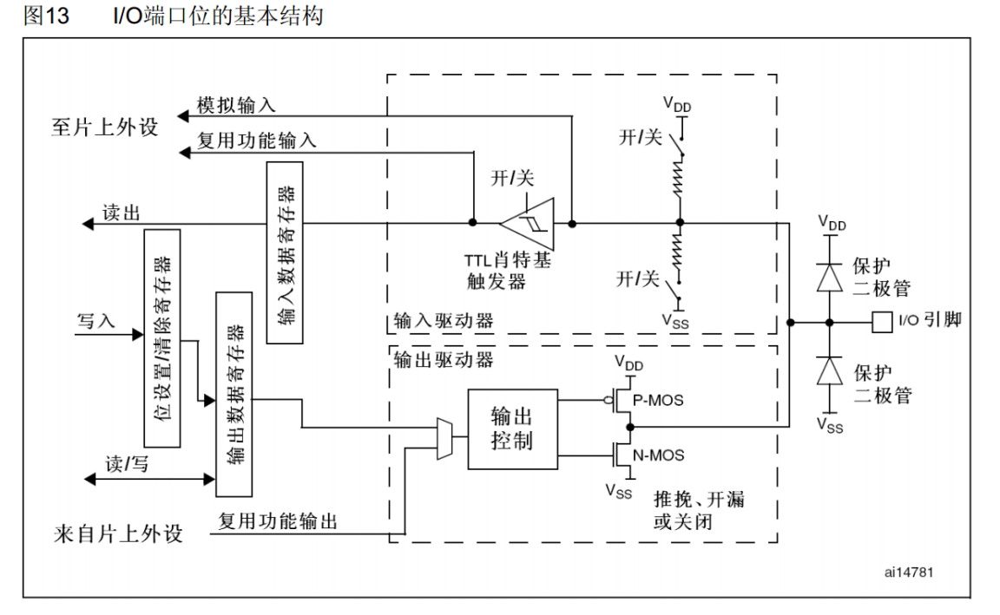
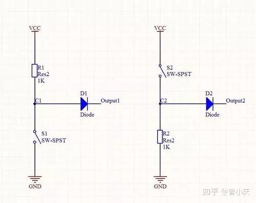
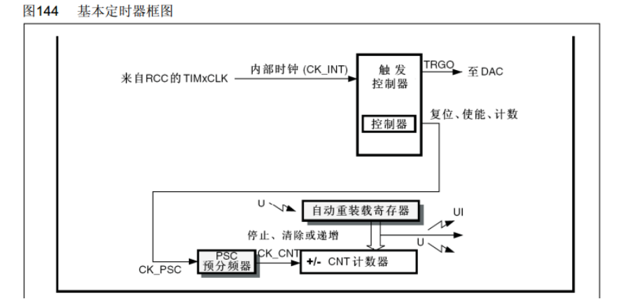
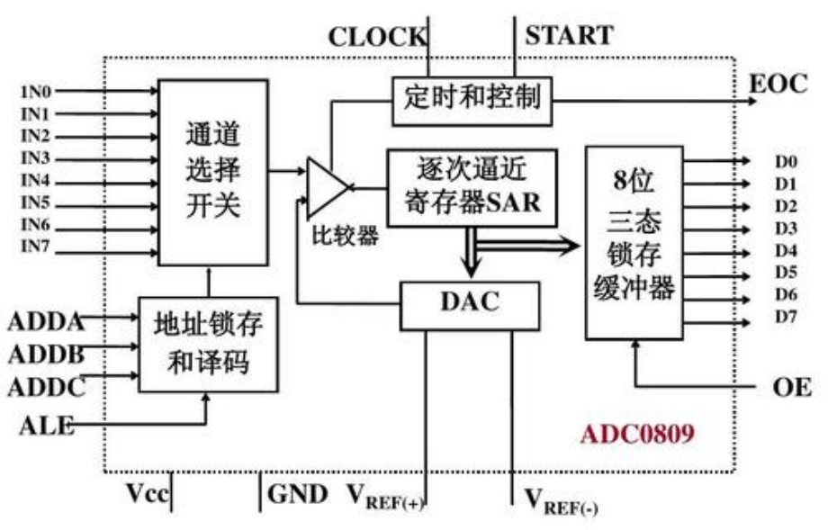
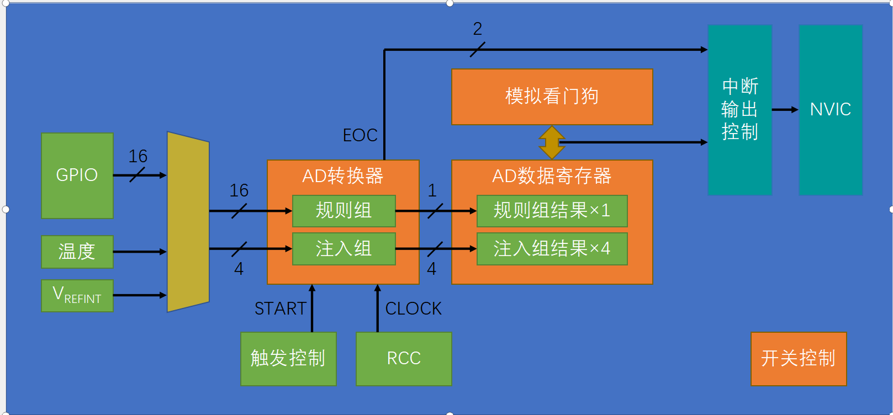

首先得明确单片机到底是什么？
可以看为一下几个部分：
- CPU：执行指令和进行计算。
- Flash：断电数据不丢失，用来存放编译后的程序。
- SARM：程序运行时存放的变量，数组，栈。
- 外设：GPIO, 定时器，ADC，USAT等专用硬件
- 总线：CPU访问外设和存储器的通道。
- RCC：给CPU和外设提供时钟，并控制外设是否工作。
最重要的认知是：
> GPIO、定时器和串口不是一段软件，它们是芯片内部真实存在的数字电路。程序只是通过寄存器控制这些电路。

例如：
```
GPIO_SetBits(GPIOA, GPIO_Pin_0);
```
这个库函数最终只是修改某个特定地址上的寄存器位。GPIO硬件看到这个位发生改变，才控制输出晶体管，使PA0引脚变成高电平。
因此：
```
库函数 → 寄存器 → 芯片内部电路 → 引脚电压变化
```
这条关系是理解整个单片机的钥匙。

OK——接下来步入正轨：

## 1.为什么使用单片机必须先开启时钟：
因为数字电路需要时钟推动状态变化。外设没有时钟时，内部的状态机和计数器不会运行。
由于stm32这类的单片机为了降低功耗，复位后通常会关闭大多数的外部时钟。因此GPIO程序通常先执行
```
RCC_APB2PeriphClockCmd(RCC_APB2Periph_GPIOA, ENABLE);
```
这句话不是“软件初始化惯例”，而是在RCC中打开通向GPIOA的时钟门。
以后配置任何外设，都可以按这条通用路径思考：
```
打开时钟
配置相关GPIO
配置外设参数
配置中断或DMA（需要时）
使能外设
读取状态或等待事件
。。。。
```
注：不同库的库数（标准库，DL库，HAL库）函名称会变化，但底层逻辑基本不变。

## 2.GPIO原理
一个GPIO引脚内部主要有两条路径：
```
GPIO输入：外部电压 → 输入缓冲器 → 输入数据寄存器 → CPU
GPIO输出：CPU → 输出数据寄存器 → 输出驱动器 → 引脚
```

### 输入模式
- **浮空输入**：引脚悬空时没有确定电平，容易受到干扰。
- **上拉输入**：内部弱电阻把引脚默认拉到高电平。
- **下拉输入**：内部弱电阻把引脚默认拉到低电平。
- **模拟输入**：关闭数字输入路径，让信号直接进入ADC等模拟外设。
上拉电阻的作用不是“输出高电平”，而是在没有其他设备驱动线路时，提供一个确定的默认状态。
例如按键一端接地：
```
松开：内部上拉使输入为1
按下：按键把引脚连接到GND，输入为0
```

这就是一个上拉和下拉的电路图，看到这里时可能会有一个疑问：上下拉的电平不是由开关控制的吗？那这里的电阻有什么用？
的确，本质上上下拉是由开关来完成的，但是电阻并不能去掉，它可以防止开关闭合时VCC与GND的短路。还可以提升防干扰能力，若没有电阻只有一更导线，那么导线的寄生电容会很小

$$
V=\frac{Q}{C}
$$

当Q有了一点改变时，电压V都会变化很大。加上电阻后，现在GPIO不再悬空。假设干扰试图把GPIO电压拉低，上拉电阻会持续从3.3V提供一小股电流，把GPIO恢复到高电平。
假设干扰产生 1 μA 电流，使用 10 kΩ 上拉电阻：

$$
\Delta V=I\times R=1\,\mu\mathrm{A}\times10\,\mathrm{k}\Omega=0.01\,\mathrm{V}
$$

GPIO电压只会从3.3V变成大约3.29V，仍然是很明确的高电平。如果没有上拉电阻，等效电阻非常大。同样微小的干扰电流就可能明显改变引脚电压。

### 输出模式
#### 推挽输出
内部有两个晶体管：
- 一个负责把引脚接向电源
- 一个负责把引脚接向地
因此它可以主动输出高电平，也可以主动输出低电平。驱动能力强，适合LED、蜂鸣器、普通数字信号和SPI。

#### 开漏输出
开漏只能完成两种动作：
- 导通，把线路拉低
- 关闭，释放线路
它不能主动输出高电平，必须依靠上拉电阻得到高电平。
这使多个设备可以共享一根线：
- 任意设备拉低，线路就是低电平
- 所有设备都释放，线路才由上拉电阻拉高
这正是I²C要求SDA、SCL使用开漏结构的核心原因。它可以避免一个设备输出高电平、另一个设备输出低电平时产生严重冲突。

## 3.中断，定时器与PWM
它们看似是三个知识点，实际都围绕同一个定时器硬件展开：
```
时钟 → PSC预分频 → CNT计数器 → ARR/CCR比较 → 事件、中断或引脚输出
```
### 中断
#### 中断解决什么问题？
假设按键按下后点亮LED，最简单的方法是轮询：
```
while (1)
{
    if (GPIO_ReadInputDataBit(GPIOA, GPIO_Pin_0) == 0)
    {
        LED_ON();
    }
}
```
CPU会不断询问：“按了吗？按了吗？按了吗？”
这种方式有两个问题：
- CPU一直做重复检查
- 主程序繁忙时，可能错过持续时间很短的事件

就可以用中断改成由硬件主动通知CPU：
```
CPU执行主程序
        ↓
按键产生下降沿
        ↓
EXTI设置中断标志
        ↓
NVIC通知CPU
        ↓
CPU跳到中断函数
        ↓
处理完成后返回主程序
```
中断类似硬件发给CPU的一次“紧急函数调用”。

#### 中断发生时，硬件做了什么
以按键外部中断为例：
```
GPIO引脚
→ EXTI检测边沿
→ EXTI挂起标志位置1
→ NVIC判断是否允许响应
→ CPU暂停当前程序
→ 查找中断向量表
→ 执行对应的中断函数
```
详情请看：[中断](中断.md)

典型处理函数：
```
void EXTI0_IRQHandler(void)
{
    if (EXTI_GetITStatus(EXTI_Line0) == SET)
    {
        KeyFlag = 1;

        EXTI_ClearITPendingBit(EXTI_Line0);
    }
}
```
这里有两个关键点。
##### 为什么需要检查标志位
多个事件有时会共用一个中断入口。例如EXTI5～EXTI9共用一个中断函数。进入函数后，需要检查究竟是哪条线触发。
##### 为什么必须清除中断标志
外设用标志位表达“事件已经发生”。
如果处理完不清除，标志仍然为1。CPU退出中断后会发现请求仍存在，于是立刻再次进入中断，主程序可能永远无法继续执行。

#### 中断函数为什么应该短？
不建议这样写：
```
void EXTI0_IRQHandler(void)
{
    Delay_ms(1000);
    OLED_ShowString(...);
    CalculateSomething();
}
```
因为处理中断期间：
- 主程序暂停
- 同级或更低优先级中断需要等待
- 系统实时性变差
- 阻塞式延时可能依赖另一个无法执行的中断，造成卡死
更稳妥的方式：
```
volatile uint8_t KeyFlag;

void EXTI0_IRQHandler(void)
{
    if (EXTI_GetITStatus(EXTI_Line0) == SET)
    {
        KeyFlag = 1;
        EXTI_ClearITPendingBit(EXTI_Line0);
    }
}

int main(void)
{
    while (1)
    {
        if (KeyFlag == 1)
        {
            KeyFlag = 0;
            // 在主循环完成复杂处理
        }
    }
}
```
注：`volatile` 告诉编译器：这个变量可能被中断等程序流程之外的因素改变，每次使用时都应从内存重新读取。

#### NVIC优先级
STM32F103使用NVIC统一管理中断。优先级数字越小，优先级越高。这里很容易理解反：
```
优先级0  高
优先级1  ↓
优先级2  ↓
优先级15 低
```
优先级包含两个概念：
- **抢占优先级**：能不能打断当前中断
- **响应优先级**：多个中断同时等待时，谁先执行
例如：
```
中断A：抢占优先级1，响应优先级3
中断B：抢占优先级2，响应优先级0
```
A的抢占优先级更高，所以A可以打断正在运行的B。B虽然响应优先级数字更小，但响应优先级不能用于抢占。

### 定时器
定时器本质是一个由时钟驱动的计数器：
STM32F103通用定时器中的关键寄存器：
- `PSC`：预分频器
- `CNT`：当前计数值
- `ARR`：自动重装值
- `CCR`：捕获/比较值
```
定时器时钟 → PSC预分频 → CNT计数 → 到达ARR → 更新事件
```
频率公式：

$$
f_{update}=\frac{f_{TIM}}{(PSC+1)(ARR+1)}
$$


注意公式中都有 `+1`，因为从0开始计数。
例如ARR=9999时，CNT经历：
```
0, 1, 2, ... , 9999
```
一共是10000个计数。

### 定时器中断
当CNT到达ARR并重新开始计数时，会产生“更新事件”。
如果开启更新中断：
```
CNT溢出
→ TIM更新标志位置1
→ TIM向NVIC请求中断
→ CPU执行TIM中断函数
```
示例：
```
void TIM2_IRQHandler(void)
{
    if (TIM_GetITStatus(TIM2, TIM_IT_Update) == SET)
    {
        TimeCount++;
        TIM_ClearITPendingBit(TIM2, TIM_IT_Update);
    }
}
```
所以定时器中断不是CPU自己数时间，而是定时器硬件自己计数，时间到了才通知CPU。

### PWM
#### PWM为什么能控制亮度和转速
PWM输出只有高、低两个电平，并没有真正输出连续的模拟电压。但LED亮度、电机转速等系统具有惯性，无法完全跟随快速开关，只能表现出一段时间内的平均效果。

PWM使用同一个CNT计数器，但增加CCR比较值。假设：
```
CNT < CCR：输出高电平
CNT ≥ CCR：输出低电平
```
因此：
```
CNT：0────────29 30────────99
输出：高电平      低电平
```
一个周期有100个计数，其中30个计数为高电平：

$$
\text{占空比}=\frac{30}{100}=30\%
$$

计算公式：

$$
f_{PWM}=\frac{f_{TIM}}{(PSC+1)(ARR+1)}
$$

$$
Duty=\frac{CCR}{ARR+1}
$$

注意：
- `PSC`和`ARR`主要决定PWM频率
- `CCR`主要决定占空比
- `ARR`越大，占空比调整得越精细
例如`ARR=99`时，占空比分辨率约为1%；`ARR=999`时，分辨率约为0.1%。

### 输出比较、输入捕获和编码器
它们都在使用CNT与CCR，只是数据流方向不同。
#### 输出比较
```
CNT与CCR比较
→ 硬件改变输出电平
```
PWM属于输出比较的一种应用。
#### 输入捕获
```
外部引脚出现边沿
→ 将当时的CNT复制到CCR
```
假设连续两个上升沿捕获值相差7200，定时器每秒计数720000次：

$$
T=\frac{7200}{720000}=0.01\,\mathrm{s}
$$

$$
f=\frac{1}{T}=100\,\mathrm{Hz}
$$

因此输入捕获可以测频率、周期和脉宽。
#### 编码器接口
正交编码器输出A、B两路相差90°的方波。定时器根据哪一路先变化判断方向：
```
A领先B：CNT增加
B领先A：CNT减少
```
整个判断可以由定时器硬件完成，不需要每个边沿都让CPU进入中断。
详情：[编码器电机的计数原理](编码器电机的计数原理：.md)

提问？
1. 中断函数中忘记清除中断标志，最可能出现什么现象？
2. `volatile uint8_t KeyFlag` 中，`volatile`解决的是什么问题？
3. 定时器时钟72 MHz，要求产生20 kHz PWM。如果设置`PSC=0`，`ARR`应该是多少？
4. 上题中若需要25%占空比，`CCR`应该是多少？
5. 输入捕获时，外部上升沿到来后，是把CCR复制到CNT，还是把CNT复制到CCR？

## ADC与DMA
### 模拟量与数字量
GPIO数字输入只能区分两种状态：
```
低电平：0
高电平：1
```
但传感器可能输出：
```
0.83 V
1.47 V
2.91 V
```
CPU不能直接处理连续电压，所以需要ADC把电压转换成整数。
TM32F103的ADC是12位ADC：

$$
2^{12}=4096
$$

因此转换结果范围为：
```
0～4095
```
如果参考电压为3.3 V：
```
0 V    → 0
1.65 V → 约2048
3.3 V  → 约4095
```
换算公式：

$$
\mathrm{ADC\ value}\approx\frac{V_{in}}{V_{REF}}\times4095
$$

反过来：

$$
V_{in}\approx\frac{\mathrm{ADC\ value}}{4095}\times V_{REF}
$$

这里的参考电压非常重要。ADC测量的其实是：
> 输入电压占参考电压的比例。

如果供电和参考电压并非准确的3.300 V，直接用3.3计算就会产生误差。

### 12位是什么意思
12位代表ADC只能把整个输入范围切成4096个台阶。当参考电压为3.3 V时，一个最低有效位约为：

$$
\frac{3.3\,\mathrm{V}}{4096}\approx0.000806\,\mathrm{V}=0.806\,\mathrm{mV}
$$

这叫量化分辨率。它不等于实际测量精度。实际精度还会受到：
- 参考电压波动
- 电源噪声
- ADC自身误差
- 传感器误差
- PCB布线和接地
- 采样时间是否足够
影响。
因此“12位ADC”只代表输出具有12位，并不保证最后12位都完全准确。

### 逐次逼近ADC
一般的单片机都是这个。

可以把转换过程理解为“二分猜电压”，假设输入范围为0～3.3 V：
1. 先猜中点1.65 V
2. 比较输入比1.65 V高还是低
3. 根据结果缩小范围
4. 再猜新区间的中点
5. 重复12次，得到12位结果
例如输入约2.3 V：
```
先比较1.65 V：输入更高
再比较2.475 V：输入更低
再比较2.0625 V：输入更高
……
```
每比较一次确定一个二进制位，从最高位逐渐确定到最低位。

### 采样与转换
ADC转换不是看到引脚电压就立刻得到数字。它分为：
```
采样 → 保持 → 量化 → 编码
```
ADC内部有一个很小的采样电容。采样期间，外部信号需要给这个电容充电。
如果传感器输出阻抗较大，而采样时间太短，电容来不及充到输入电压，结果就可能偏低或不稳定。
因此：
- 低阻抗、变化快的信号可以使用较短采样时间
- 高阻抗传感器通常需要更长采样时间
- 必要时用运算放大器进行电压跟随和缓冲
STM32F103的转换时间：

$$
T_{CONV}=T_{sample}+12.5\,T_{ADC}
$$

例如ADC时钟为14 MHz，采样时间为1.5周期：

$$
T=\frac{1.5+12.5}{14\,\mathrm{MHz}}=1\,\mu\mathrm{s}
$$

理论上每秒最多约转换100万次，但真实应用还要考虑触发、数据读取和通道切换。



### 单通道、扫描与连续转换
这两个维度经常混淆。
#### 是否扫描
- 非扫描：只转换一个通道
- 扫描：按照设定顺序转换多个通道
例如扫描序列：
```
第1个：PA0
第2个：PA1
第3个：内部温度
```
#### 是否连续
- 单次：触发一次，执行一次转换序列后停止
- 连续：完成后自动重新开始
它们可以组合：

| 模式     | 行为         |
| ------ | ---------- |
| 单次、非扫描 | 转换一个通道一次   |
| 连续、非扫描 | 重复转换同一个通道  |
| 单次、扫描  | 多个通道各转换一次  |
| 连续、扫描  | 不断循环转换多个通道 |
### 为什么需要DMA
如果CPU自己读取ADC：
```
启动ADC
→ 等待转换完成
→ CPU读取ADC_DR
→ CPU写入数组
→ 再次等待
```
采样频率较高或通道较多时，CPU需要不停搬数据。
DMA是一块专门负责搬运数据的硬件。使用DMA后：
```
ADC完成转换
→ 产生DMA请求
→ DMA读取ADC_DR
→ DMA写入SRAM数组
→ 地址自动增加
```
CPU不参与每一次搬运。
例如：
```
uint16_t ADValue[4];
```
连续扫描4个通道：
```
ADC通道0结果 → ADValue[0]
ADC通道1结果 → ADValue[1]
ADC通道2结果 → ADValue[2]
ADC通道3结果 → ADValue[3]
```
#### DMA需要知道的核心参数
DMA本质上只需要明确：
- 从哪里搬：外设地址
- 搬到哪里：存储器地址
- 搬多少次：传输数量
- 每次多宽：8位、16位或32位
- 哪边地址自增
- 谁触发搬运
- 搬完后是否重新开始
ADC场景中通常是：
```
外设地址：ADC数据寄存器，固定不变
存储器地址：数组首地址，每次递增
数据宽度：通常16位
方向：外设到存储器
触发：ADC转换完成
循环模式：连续采集时开启
```

### 定时器、ADC、DMA的组合
工程中常见的稳定采样链路是：
```
定时器每1 ms产生一次触发
→ ADC开始转换
→ ADC转换完成
→ DMA把结果搬入数组
→ DMA搬完一组数据后通知CPU
```
各部分分工：
- 定时器保证采样间隔稳定
- ADC负责模拟到数字转换
- DMA负责高速搬运
- CPU负责处理一整批数据
这比CPU使用延时、手动启动ADC更加稳定。
